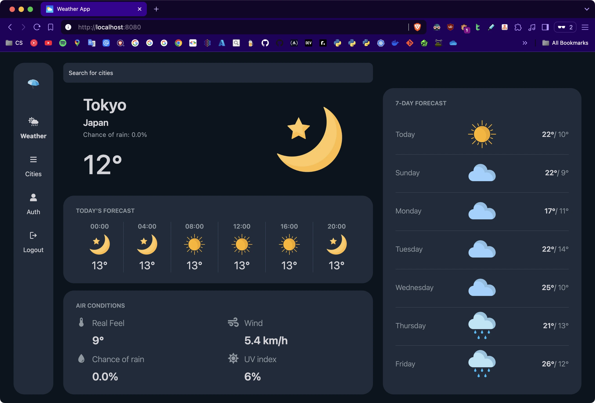
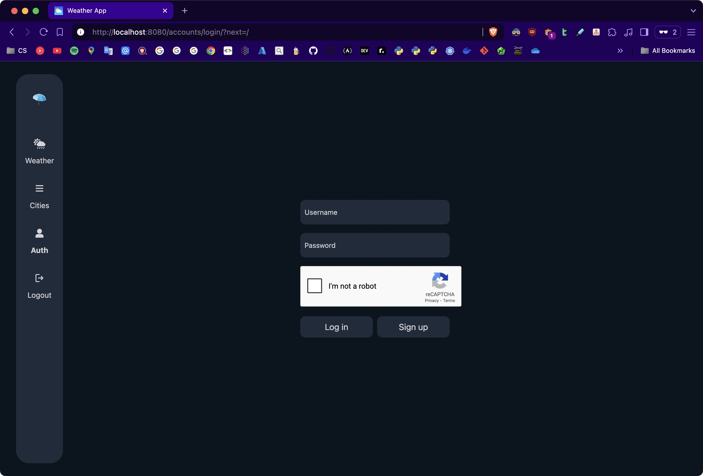
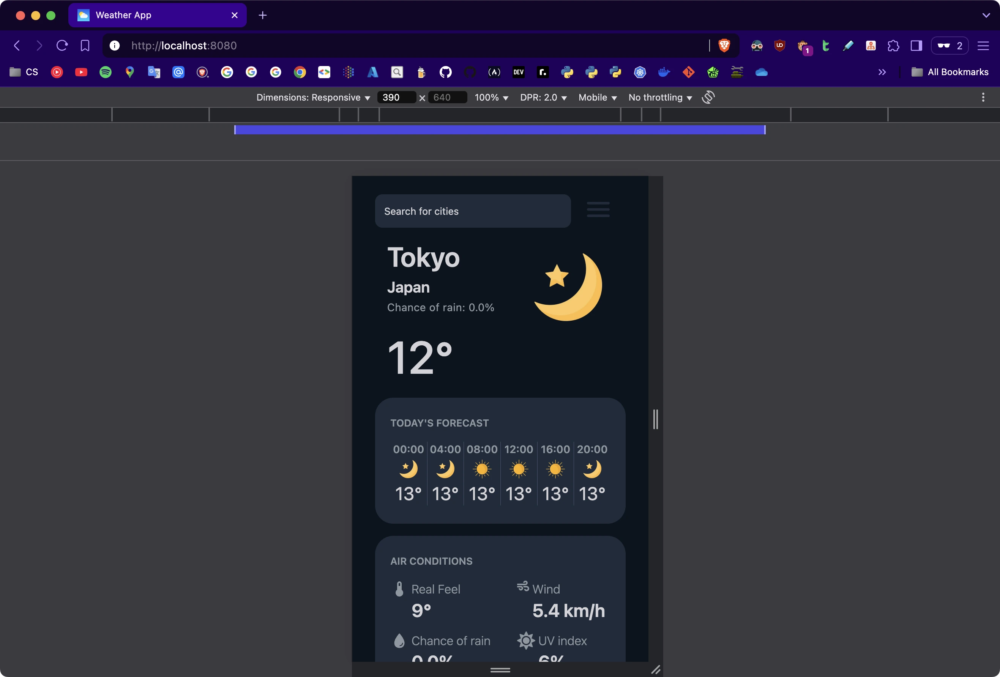
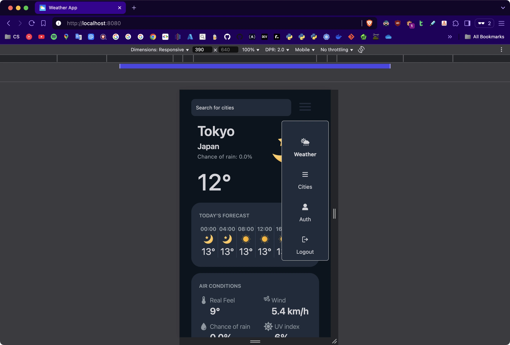
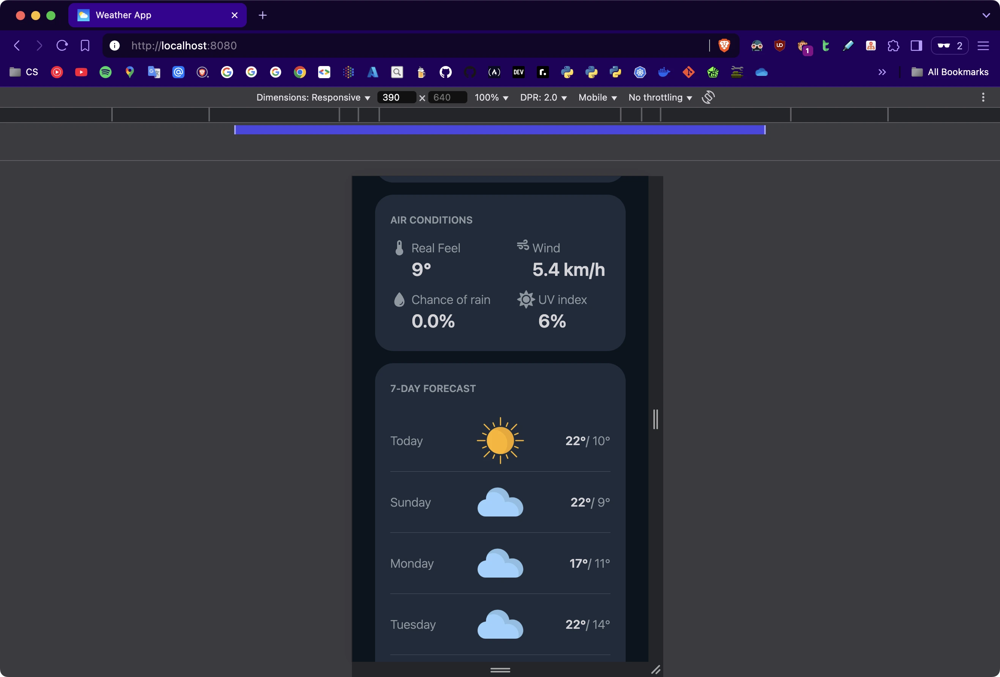
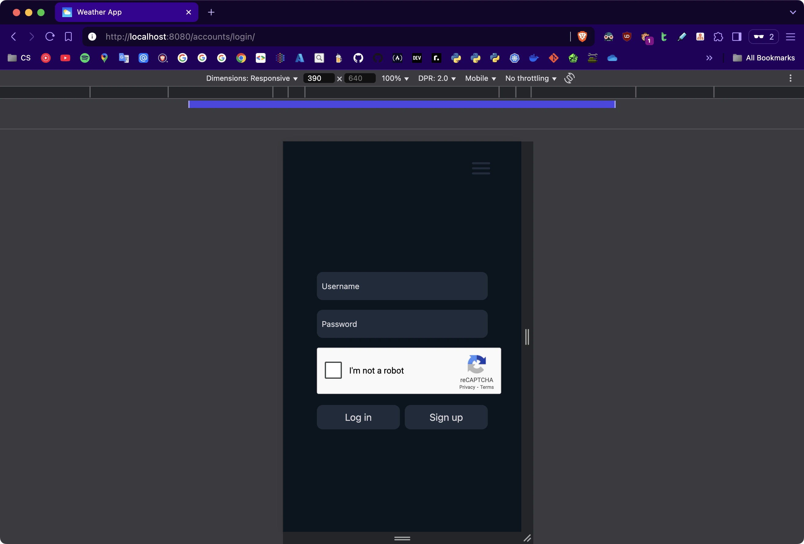

# 🌧 Weather App (Django + HTMX + Alpine.js)



## ✨ Features

- [x] [Django](https://www.djangoproject.com/) as the main backend framework
- [x] [Django-Ninja](https://django-ninja.dev/) for building APIs with type hints
- [x] [django-recaptcha](https://github.com/django-recaptcha/django-recaptcha) support
- [x] [HTMX](https://htmx.org/) + [Alpine.js](https://alpinejs.dev/) that provides lightweight, reactive approach to building dynamic SSR
- [x] [TailwindCSS v4](https://tailwindcss.com/blog/standalone-cli) support (using standalone cli)
- [x] [PinesUI](https://devdojo.com/pines) support: an Alpine & Tailwind UI library of animations, sliders, and more as a set of UI elements to copy/paste
- [x] Uvicorn/Gunicorn support
- [x] A pyproject.toml file for **[uv](https://github.com/astral-sh/uv)** package manager
- [x] Manual HTML compression at runtime in middleware
- [x] [ServeStatic](https://github.com/Archmonger/ServeStatic) support (a WhiteNoise alternative for ASGI) for simplified static file serving
- [x] A number of largely populated cities in `weather_cities_dump.sql` (47868 variations/cities) with the following columns:
  - city
  - country
  - latitude
  - longitude
  - population
- [x] Has scripts for:
  - Development mode (`./scripts/dev.sh`)
  - Pre-production mode (`./scripts/preprod.sh`)
  - Testing mode (`./scripts/pytest.sh`)
- [x] [Docker](https://www.docker.com/)/[Podman](https://podman.io/) support
- [ ] Kubernetes support
- [x] [Nginx](https://nginx.org/en/) support
- [ ] [Fail2Ban](https://github.com/fail2ban/fail2ban) support against DDoS attacks and multiple authentication errors

## 🛠️ Installation

The easiest way to run the app locally is to use Docker/Podman as follows:

- Ensure, that all ports (`8433` for app, `5432` for postgres, `6379` for redis) are not currently in use (use `lsof -i -P | grep LISTEN` to check busy ports in UNIX systems)
- Ensure, that you uncommented `[sshd]` & `[sshd-ddos]` in **fail2ban/jail.local** if deciding not to implement SSH/HTTPS inside container
- To load the app with the simplest configuration, run:
  `docker compose -f compose.yml -f compose.nginx.yml -f compose.redis.yml up --build`
  or
  `podman-compose -f compose.yml -f compose.nginx.yml -f compose.redis.yml up --build`
- If you don't want to use **Nginx**, replace it with `-f compose.servestatic.yml` (don't forget to check the ports running; they have to be as same as **DJANGO_PORT**)
- To add Postgres into the app, append `-f compose.postgres.yml` before `up --build`

In case you decide to host on the platform (in my case, it is AWS EC2):

- Sign-up (or sign-in) to your account where you want to host it
- Run the Cloud Machine (specifically **Ubuntu**, but **Debian** & **Fedora** are fine too)
- Fetch the list of available updates (via `sudo apt-get update`)
- Install necessary tools (via `sudo apt-get install curl vim git nginx -y`)
- Install uv package manager and source the environment (`curl -LsSf https://astral.sh/uv/install.sh | sh && source "$HOME/.local/bin/env"`)
- Clone this repository to the folder called **app/** (`git clone github.com/KananHasanov747/django_weather_app.git app/`)
- Move to the **app/** directory (`cd app/`)
- Check the path to the **app/** directory (`pwd`) and replace it in the following files (the default set is **/home/ubuntu/app/**):
  - nginx/sites-available/django
  - gunicorn/gunicorn.service
- Copy Gunicorn files into **/etc/systemd/system/** (`sudo cp gunicorn/gunicorn.{service,socket} /etc/systemd/system/`)
- Open the file **nginx/sites-available/django** in the same **app/** directory (with **vim**) and replace **<EC2.PUBLIC.DOMAIN.OR.IP>** with the public IP of your cloud machine
- Copy Nginx file into **/etc/nginx/sites-available/** (`sudo cp nginx/sites-available/django /etc/nginx/sites-available/django`)
- Create a link to that file for **/etc/nginx/sites-enabled/** (`sudo ln -s /etc/nginx/sites-available/django /etc/nginx/sites-enabled/`)
- Replace **.env.example** to **.env.prod** (`mv .env.example .env.prod`), open it via **vim**, and add values to variables
- Run the following commands:

  ```shell

  uv run --no-dev manage.py collectstatic --no-input --clear
  uv run --no-dev manage.py migrate
  uv run --no-dev manage.py createsuperuser --no-input
  ```

- Run **systemctl** commands to keep the daemon working in the background:
  ```shell
  sudo systemctl enable --now gunicorn.socket nginx
  sudo systemctl start nginx
  ```
- Check if they are working correctly:
  ```
  sudo nginx -t
  sudo systemctl status gunicorn
  sudo systemctl status nginx
  ```
- Open the new tab (or a Browser) and enter your public IP address. In case you see, that the CSS or Javascript are not loading, try to add privilege (`chmod +x /path/to/your/project/app`)

## 🖼️ Media

<div style="display: grid; grid-template-columns: repeat(3, minmax(0, 1fr));">
    
    
    
    
    
</div>
