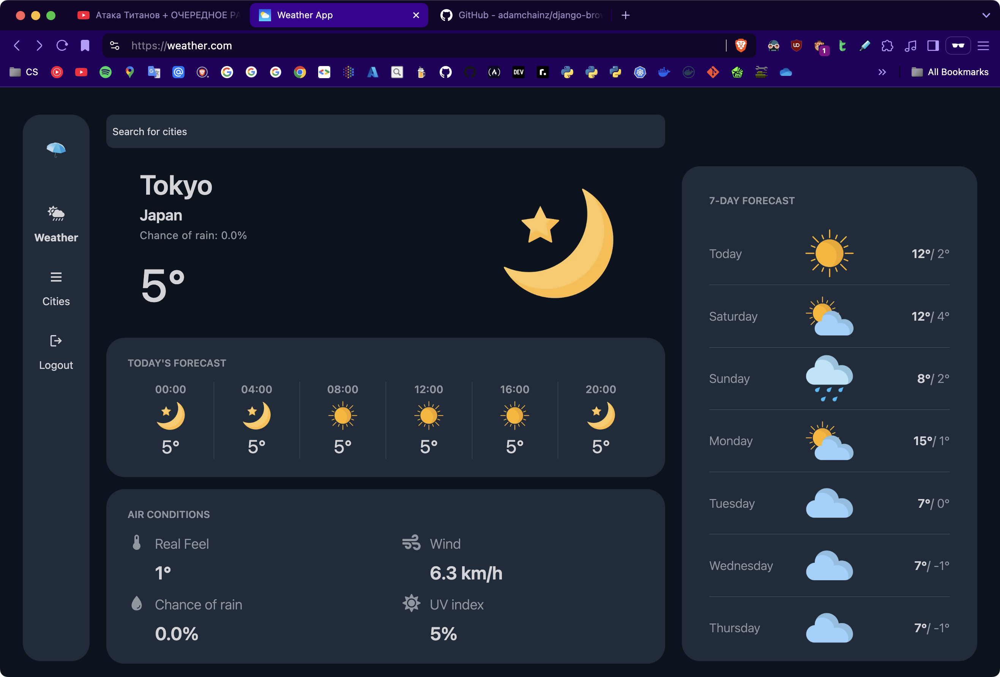

# 🌧 Weather App (Django + HTMX + Alpine.js)

## ✨ Features

- [x] [Django](https://www.djangoproject.com/) as the main backend framework
- [x] [Django-Ninja](https://django-ninja.dev/) for building APIs with type hints
- [x] [HTMX](https://htmx.org/) + [Alpine.js](https://alpinejs.dev/) that provides lightweight, reactive approach to building dynamic SSR
- [x] [TailwindCSS v4](https://tailwindcss.com/blog/standalone-cli) support (using standalone cli)
- [x] Uvicorn support
- [x] A pyproject.toml file for **[uv](https://github.com/astral-sh/uv)** package manager
- [x] Manual HTML compression at runtime in middleware
- [x] [ServeStatic](https://github.com/Archmonger/ServeStatic) support (a WhiteNoise alternative for ASGI) for simplified static file serving
- [x] A number of largely populated cities in `weather_cities_dump.sql` (47868 variations/cities) with the following columns:
  - city
  - country
  - latitude
  - longitude
  - population
- [x] Has custom `client/` commands for:
  - Development mode (`uv run manage.py dev` or `.venv/bin/python manage.py dev`)
  - Pre-production mode (`uv run manage.py preprod` or `.venv/bin/python manage.py preprod`)
  - Testing mode (`uv run manage.py pytest` or `.venv/bin/python manage.py pytest`)
- [x] Docker containerization
- [-] Kubernetes support
- [x] [Nginx](https://nginx.org/en/) support
- [-] [Fail2Ban](https://github.com/fail2ban/fail2ban) support for DDoS attacks and multiple authentication errors

## 🛠️ Installation

The easiest way to run the app locally is to use Docker/Podman and choose the following:

- Ensure, that all ports (8433 for app, 5432 for postgres, 6379 for redis) are not currently in use (use `lsof -i -P | grep LISTEN` to check busy ports in UNIX systems)
- To load the app with the simplest configuration, run:
  `docker compose -f compose.yml -f compose.servestatic.yml up --build`
  or
  `podman-compose -f compose.yml -f compose.servestatic.yml up --build`
- To add Nginx into the app, replace `compose.servestatic.yml` with `compose.nginx.yml`
- To add Redis into the app, append `-f compose.redis.yml` before `up --build`
- To add Postgres into the app, append `-f compose.postgres.yml` before `up --build`
